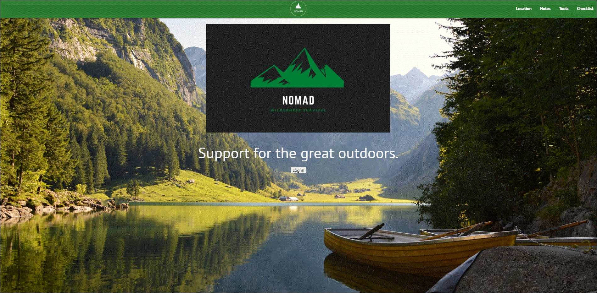

# Wilderness-Survival-App
​
 </br>
    </br>
    </br>
​
This Heroku hosted Progressive Web App (PWA) aims to provide a simple, user-friendly and straight forward experience to guide users in survival situations. With its capability to run in offline mode, users are able to navigate the app without consistent access to the internet. As most of the PWA is available without network connection, Nomad is a great app for those who may go in and out of connectivity throughout the day or are in wilderness areas where the connection is less reliable. 
Nomad will assist users in finding edible plants, nearby animals and provide several survival guides. In addition, the user is able to refer to a wilderness checklist as well as document, edit and delete notes during their adventure. 
​
## Table of Contents
[Deployed Application](https://github.com/Rogers-Development-Services/Wilderness-Survival-App.github.io#deployed-application)</br>
​
[Installation](https://github.com/Rogers-Development-Services/Wilderness-Survival-App.io#installation)</br>
​
[Usage](https://github.com/Rogers-Development-Services/Wilderness-Survival-App.io#usage)</br>
​
[Screenshots](https://github.com/Rogers-Development-Services/Wilderness-Survival-App.io#screenshots)</br>
​
[Testing](https://github.com/Rogers-Development-Services/Wilderness-Survival-App.io#testing)</br>
​
[Future Updates](https://github.com/Rogers-Development-Services/Wilderness-Survival-App.io#future-updates)</br>
​
[Questions](https://github.com/Rogers-Development-Services/Wilderness-Survival-App.io#questions)</br>
​
[Credits](https://github.com/Rogers-Development-Services/Wilderness-Survival-App.io#credits)</br>
​
[License](https://github.com/Rogers-Development-Services/Wilderness-Survival-App.io#license)
​
## Deployed Application
​
Here is an example of our app in action:</br> 
​
Access our [deployed application here!]()
​
## Installation
​
Download this package, open your command line interface and run npm install. This should install the following dependencies aswell: Express, MongoDB, Mongoose, and React.  If for some reason, you need to install the dependencies individually run npm install "dependency_name".(see the "npm install express" example)
​
Next run the following command to install the app: 
​
```bash
npm install 
```
```bash
npm install express
```
​
Note: This app is run on a Heroku server, it is not necessary to download.
​
## Usage 
​
If you have downloaded the repository and have cloned the package to your machine, and have installed all dependencies, begin by typing "npm start". 
​
```bash
npm start 
```
​​
### Screenshots
​

## Testing
​
Testing Instructions: Currently, there are no written tests for this application, but if you wish to write your own, change the scripts property in package json file.
​
```bash
npm install jest
```
```bash
npm test
```
​
Note if you want to test server side changes more efficently, install and run nodemon using your CLI application to host your server. While running it and making changes to your directory, simply save your file and nodemon will restart the server.
​
```bash
npm install -g nodemon
```
```bash
nodemon server.js
```
## Future Updates
This application is a work in progress, future updates will include: 
1. Offline banner message
2. Ability to save maps offline
3. Enhancement to the hamburger
4. Incorporate Toasts to alert users 
5. Rich text editor for the Collapsibles 

## Questions
​
Share with us with any comments or questions to help us grow! 
​
GitHub Contributors: 
[Jeneth Diesta](https://github.com/jen6one9), 
[Aaron Platt](https://github.com/aaronkplatt), 
[Timothy Sanders](https://github.com/tbsanders5), 
[Elliott Jones](https://github.com/JonesElliott), and [Matthew Rogers](https://www.github.com/Rogers-Development-Services) 
​
## Credits
​
Code boilerplate provided by Trilogy Education & Chris Stead
​
Thanks to Chris Stead, Elma Gonzalez, Steven Jirjis and Steven Landgraf for troubleshooting and debugging assistance.
​
## Licenses

Licensed under the MIT License lincense.

A screenshot of your Project Management Board that shows breakdown of tasks, assigned to group members with a schedule.

## Technical Requirements
* Must use ReactJS in some way (even if minimal)
* Must use a Node and Express Web Server
* Must be backed by a MySQL or MongoDB Database with a Sequelize or Mongoose ORM  
    * MongoDB
    * Mongoose
* Must have both GET and POST routes for retrieving and adding new data
* Must be deployed using Heroku (with Data)
* Must utilize at least two libraries, packages, or technologies that we haven’t discussed
    * LOCAL FORAGE & FUSION AUTH
* Must allow for or involve the authentication of users in some way
    * Fusion AUth
* Must have a polished frontend/UI 
    * Materialize 
* Must have folder structure that meets MVC Paradigm
* Must meet good quality coding standards (indentation, scoping, naming)
* Must not expose sensitive API key information on the server

## Color Scheme:
* #2E7D32
* #ffffff
* ##808080


## Wireframe: 
[Click Here for our outline](https://slack-imgs.com/?c=1&o1=ro&url=https%3A%2F%2Fs3.amazonaws.com%2Fassets.mockflow.com%2Fapp%2Fwireframepro%2Fcompany%2FCa7256b44d73b4257b2884d30210e64e7%2Fprojects%2FMe6dd3a2e9e27ee5c72cf4f76de3a33f41605552968657%2Fpages%2Ff9fd5991f23545a2a75188c6718a3ba2%2Fimage%2Ff9fd5991f23545a2a75188c6718a3ba2.png)

## User Stories
[Click Here for our User Stories](https://docs.google.com/spreadsheets/d/1UpVH7u-TKHPJdKX1x6HFqRxYiuRFf75wdM8JwPEmWXk/edit?usp=sharing)

## References
Location map: https://morioh.com/p/8461df41e752#google_vignette
Plants:  https://morningchores.com/edible-wild-plants/, https://www.outdoorlife.com/blogs/survivalist/2014/05/survival-skills-14-wild-medicinal-plants/
Animals: https://en.wikipedia.org/wiki 
Guides: https://www.tacticalogy.com/survival-tips/
Survival Checklist: http://www.lovetheoutdoors.com/camping/checklists.htm 
